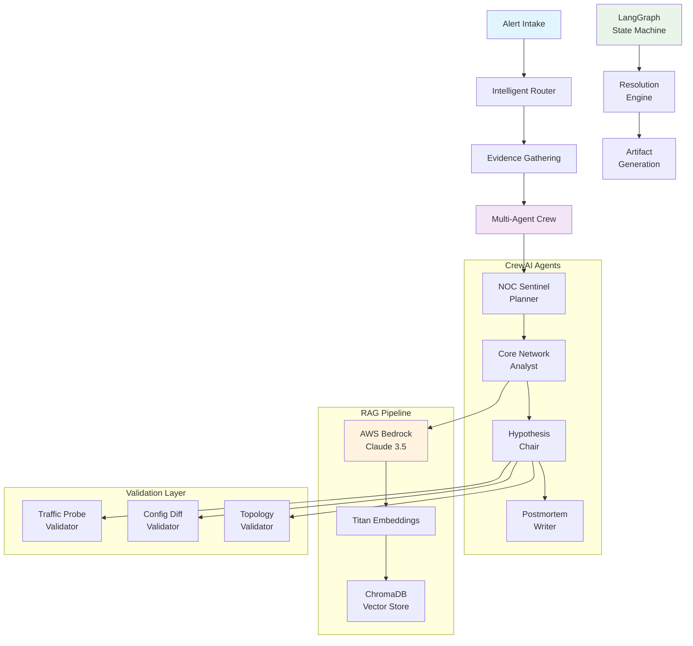

# 🔧 Intelligent Fault Diagnosis Multi-Agent System

[](https://python.org)
[](https://crewai.com)
[](https://langchain-ai.github.io/langgraph/)
[](https://aws.amazon.com/bedrock/)
[](https://choosealicense.com/licenses/mit/)

> **Enterprise-grade intelligent fault diagnosis system leveraging multi-agent AI, stateful workflows, and RAG-powered knowledge retrieval for automated network troubleshooting.**

An advanced AI-powered system that demonstrates cutting-edge multi-agent orchestration, intelligent workflow management, and retrieval-augmented generation for automated fault diagnosis in telecommunications networks. This project showcases enterprise-ready AI engineering with production-quality architecture, comprehensive validation, and deterministic demonstration capabilities.

## 🎬 **Watch It In Action**

<div align="center">

### 🚀 **Complete System Demo**


*Multi-agent coordination • RAG pipeline • Real-time validation • Artifact generation*

</div>

## 🎯 **Project Highlights**

### **🤖 Advanced Multi-Agent Architecture**
- **CrewAI Orchestration**: Four specialized AI agents with distinct roles and personas
- **Intelligent Collaboration**: Coordinated handoffs and shared state management
- **Domain Expertise**: Telecom-specific knowledge and reasoning capabilities

### **🧠 Sophisticated AI Pipeline**
- **RAG-Powered Knowledge**: AWS Bedrock with Claude 3.5 Sonnet and Titan embeddings
- **Stateful Workflows**: LangGraph for complex decision routing and escalation handling
- **Hypothesis Validation**: Multiple specialized validators with confidence scoring
- **Intelligent Routing**: Dynamic workflow paths based on confidence thresholds

### **🏗️ Production-Ready Engineering**
- **Comprehensive Error Handling**: Graceful fallbacks and robust error recovery
- **Session Management**: Artifact generation with complete audit trails
- **Observability**: Real-time monitoring and detailed logging
- **Deterministic Demos**: Reproducible presentations for stakeholders

---

## 🏛️ **System Architecture**



## 🚀 **Quick Start**

### **Prerequisites**
- **Python 3.9+** with pip
- **AWS Account** with Bedrock access (optional for demo mode)
- **Git** for version control

### **⚡ Instant Demo**
```bash
# Clone and run in 30 seconds
git clone <repository-url>
cd fault-diagnosis-multi-agent
./run_demo.bat  # Windows
# or
python -m venv venv && source venv/bin/activate  # Linux/macOS
pip install -r requirements.txt
python -m src.fault_diagnosis.cli fault-diagnosis --session demo
```

### **🔧 Full Setup**

1. **Environment Setup**
   ```bash
   # Create virtual environment
   python -m venv venv

   # Activate environment
   venv\Scripts\activate  # Windows
   source venv/bin/activate  # Linux/macOS

   # Install dependencies
   pip install -r requirements.txt
   ```

2. **AWS Configuration** (Optional - system works without AWS)
   ```bash
   # Create .env file
   cp .env.example .env

   # Edit .env with your AWS credentials
   AWS_ACCESS_KEY_ID=your_access_key
   AWS_SECRET_ACCESS_KEY=your_secret_key
   AWS_DEFAULT_REGION=us-east-1
   ```

3. **Run Demonstration**
   ```bash
   # Full featured demo with RAG
   python -m src.fault_diagnosis.cli fault-diagnosis --session alpha

   # Quick demo without RAG
   python -m src.fault_diagnosis.cli fault-diagnosis --no-rag --session beta
   ```

---

## 💼 **Core Capabilities**

### **🎭 Multi-Agent Crew**

| Agent | Role | Specialization |
|-------|------|----------------|
| **NOC Sentinel** | 🎯 **Planner** | Alert triage, workflow coordination, objective alignment |
| **Core Network Analyst** | 🔍 **Retriever** | Evidence gathering, RAG queries, knowledge search |
| **Hypothesis Chair** | 🧠 **Reasoner** | Root cause analysis, hypothesis generation, validation |
| **Postmortem Writer** | 📝 **Reporter** | Documentation, remediation plans, stakeholder reports |

### **🔄 Intelligent Workflow States**

```python
# Workflow progression with automatic routing
Alert Intake → Evidence Gathering → Hypothesis Generation
     ↓                ↓                      ↓
Routing Decision → Validation Loop → Resolution Planning
     ↓                ↓                      ↓
Remediation → Post-Mortem → Knowledge Update
```

### **🎯 Validation Framework**

- **Traffic Probe Validator**: Network performance claim verification
- **Config Diff Validator**: Configuration change impact analysis
- **Topology Validator**: Network topology reference checking
- **Confidence Scoring**: Probabilistic validation with threshold-based routing

---

## 🎪 **Demo Experience**

### **🎥 Live Execution**

The system provides real-time multi-agent coordination, RAG queries, and validation in action through the interactive CLI demo.

### **Command Examples**
```bash
# Standard demo run
python -m src.fault_diagnosis.cli fault-diagnosis --session production_demo

# Quiet mode for presentations
python -m src.fault_diagnosis.cli fault-diagnosis --quiet --session stakeholder_demo

# Test mode without external dependencies
python -m src.fault_diagnosis.cli fault-diagnosis --no-rag --session test_run
```

### **Sample Output**
```
Starting Simple Fault Diagnosis MVP
========================================

Component Status:
  [OK] CrewAI Agents: Available
  [OK] LangGraph Workflow: Available
  [OK] RAG Pipeline: Available
  [OK] Validation Framework: Available

Running workflow...

[CrewAI] NOC Sentinel analyzing alert FD-ALRT-017...
[RAG] Retrieved 3 relevant documents from knowledge base
[LangGraph] Routing to hypothesis generation (confidence: 0.87)
[Validator] Traffic probe validation: PASSED
[Workflow] Generating remediation plan...

MVP Demo complete!
Results: Session artifacts saved to outputs/session_production_demo_20241219/
```

---

## 🧪 **Technology Deep Dive**

### **🤖 CrewAI Integration**
```python
# Sophisticated agent orchestration
class FaultDiagnosisCrew:
    def __init__(self):
        self.agents = FaultDiagnosisAgents()
        self.workflow = FaultDiagnosisWorkflow()

    def execute_sequential_process(self):
        # Coordinated multi-agent execution
        return self.crew.kickoff()
```

### **🧠 LangGraph State Management**
```python
# Stateful workflow with intelligent routing
class FaultDiagnosisWorkflow:
    def route_decision(self, state):
        confidence = state.get("confidence_score", 0.0)
        if confidence > 0.7:
            return "remediation_planning"
        else:
            return "escalation_queue"
```

### **📚 RAG Pipeline Architecture**
```python
# AWS Bedrock integration with fallback
class BedrockRAGPipeline:
    def __init__(self):
        self.embeddings = BedrockEmbeddings(
            model_id="amazon.titan-embed-text-v1"
        )
        self.llm = BedrockLLM(
            model_id="anthropic.claude-3-5-sonnet-20241022-v2:0"
        )
        self.vector_store = ChromaDB()
```

---

## 📊 **Project Structure**

```
fault-diagnosis-multi-agent/
├── 🎯 src/fault_diagnosis/           # Core system implementation
│   ├── 🤖 agents/                   # Multi-agent orchestration
│   │   ├── crew_orchestration.py   # CrewAI crew setup and management
│   │   ├── factory.py               # Agent factory with role definitions
│   │   ├── tasks.py                 # Task definitions and coordination
│   │   └── crew.py                  # Agent personas and capabilities
│   ├── 🔄 workflow/                 # Stateful workflow management
│   │   ├── orchestrator.py          # Main workflow coordinator
│   │   ├── state_machine.py         # LangGraph state transitions
│   │   └── workflow.py              # Workflow execution logic
│   ├── 📚 rag/                      # RAG pipeline implementation
│   │   └── pipeline.py              # AWS Bedrock RAG integration
│   ├── 🛣️ routing/                  # Intelligent decision routing
│   │   └── intelligent_router.py    # Dynamic workflow routing
│   ├── ✅ validation/               # Hypothesis validation framework
│   │   └── validators.py            # Specialized domain validators
│   ├── 📊 monitoring/               # System observability
│   │   └── observability.py         # Metrics and monitoring
│   ├── 🗂️ data/                     # Data management and fixtures
│   │   └── fixtures.py              # Test data and scenarios
│   ├── 🎨 artifacts/                # Report and artifact generation
│   │   └── generators.py            # Output formatting and reports
│   ├── 🔧 shared/                   # Shared utilities
│   │   ├── console.py               # CLI output formatting
│   │   └── files.py                 # File system operations
│   └── 🖥️ cli.py                    # Command-line interface
├── 📁 fixtures/                     # Demo data and test scenarios
├── 📁 outputs/                      # Generated session artifacts
├── 📁 docs/                         # Technical documentation
├── 🔧 requirements.txt              # Python dependencies
├── 🚀 run_demo.bat                  # Quick demo launcher
└── 📖 README.md                     # This file
```

---

## ⚙️ **Configuration**

### **Environment Variables**
```bash
# AWS Bedrock Configuration
AWS_ACCESS_KEY_ID=your_access_key_here
AWS_SECRET_ACCESS_KEY=your_secret_key_here
AWS_DEFAULT_REGION=us-east-1

# Model Configuration
BEDROCK_LLM_MODEL=anthropic.claude-3-5-sonnet-20241022-v2:0
BEDROCK_EMBEDDING_MODEL=amazon.titan-embed-text-v1

# System Configuration
FAULT_DIAGNOSIS_CONFIDENCE_THRESHOLD=0.7
FAULT_DIAGNOSIS_VERBOSE=true
```

### **Component Features**
- **🔄 RAG Pipeline**: Semantic search with AWS Bedrock embeddings
- **🤖 Multi-Agent**: CrewAI orchestration with specialized roles
- **📊 State Management**: LangGraph workflow with decision routing
- **✅ Validation**: Multi-layer hypothesis verification
- **📈 Monitoring**: Real-time observability and metrics
- **🎯 Routing**: Intelligent workflow path selection

---

## 📈 **Generated Artifacts**

Each session produces comprehensive outputs:

### **📊 Reports & Documentation**
- `fault_diagnosis_report.html` - Executive stakeholder report
- `fault_diagnosis_report.pdf` - Printable documentation
- `hypothesis_board.md` - Detailed technical analysis
- `remediation_plan.md` - Step-by-step action guide

### **🔍 Technical Artifacts**
- `session.log` - Complete execution transcript
- `alert_context.json` - Processed alert data
- `validation_trace.json` - Validator results and decisions
- `rag_index.json` - Knowledge retrieval citations

### **📊 Visualizations**
- KPI trend plots and network metrics
- Confidence score distributions
- Validation outcome summaries
- Session timeline visualizations

---

## 🧪 **Testing & Validation**

### **Smoke Tests**
```bash
# Quick system validation
python -m src.fault_diagnosis.cli fault-diagnosis --quiet --session smoke_test

# Component isolation testing
python -m src.fault_diagnosis.cli fault-diagnosis --no-rag --session component_test
```

### **Demo Scenarios**
```bash
# Stakeholder presentation mode
python -m src.fault_diagnosis.cli fault-diagnosis --session stakeholder_demo

# Technical deep-dive mode
python -m src.fault_diagnosis.cli fault-diagnosis --session technical_demo
```

---

## 🛠️ **Development & Extension**

### **Adding New Agents**
```python
# Extend the agent factory
class CustomFaultAgent:
    def __init__(self):
        self.role = "Custom Specialist"
        self.backstory = "Domain-specific expertise..."
        self.goal = "Specialized analysis objective"
```

### **Custom Validators**
```python
# Implement domain-specific validation
class CustomValidator:
    def validate_hypothesis(self, hypothesis: str) -> ValidationResult:
        # Custom validation logic
        return ValidationResult(passed=True, confidence=0.85)
```

### **Workflow Extensions**
```python
# Add new workflow states
@workflow.step
def custom_analysis_step(state: WorkflowState):
    # Custom processing logic
    return updated_state
```

---

## 🎯 **Business Value & Use Cases**

### **🎬 Demonstration Modes**

<table>
<tr>
<td width="50%">

**👔 For Executives & Decision Makers**
```bash
python -m src.fault_diagnosis.cli fault-diagnosis --quiet --session stakeholder_demo
```
*ROI focus • Business impact • Cost reduction*

</td>
<td width="50%">

**👨‍💻 For Technical Teams**
```bash
python -m src.fault_diagnosis.cli fault-diagnosis --session technical_demo
```
*Architecture • Code quality • Implementation*

</td>
</tr>
</table>

### **Enterprise Applications**
- **🏢 Network Operations Centers**: Automated first-level incident response
- **☁️ Cloud Infrastructure**: Multi-cloud fault diagnosis and remediation
- **🏭 Industrial IoT**: Equipment failure prediction and root cause analysis
- **🚀 DevOps**: Application performance issue diagnosis and resolution

### **Technical Advantages**
- **⚡ Rapid Deployment**: Minutes from clone to running demo
- **🔧 Modular Architecture**: Easy component swapping and extension
- **📊 Rich Observability**: Complete audit trails and session recordings
- **🎯 Domain Adaptable**: Easily customizable for different industries

### **Stakeholder Benefits**
- **👔 Executives**: ROI demonstration through automated incident response
- **👨‍💻 Engineers**: Advanced AI tooling for complex problem solving
- **📋 Operations**: Reduced MTTR and improved service reliability
- **🎓 Learning**: Comprehensive example of production AI engineering

---

## 🤝 **Contributing**

This project demonstrates advanced AI engineering patterns and welcomes contributions:

```bash
# Development setup
git clone <repository-url>
cd fault-diagnosis-multi-agent
python -m venv venv
source venv/bin/activate  # or venv\Scripts\activate on Windows
pip install -r requirements.txt

# Run tests
python -m src.fault_diagnosis.cli fault-diagnosis --session test

# Submit improvements
git checkout -b feature/enhancement
# Make changes...
git commit -m "feat: add new capability"
git push origin feature/enhancement
```

---

## 📚 **Documentation**

- **📖 [Technical Deep Dive](docs/Fault_Diagnosis.md)** - Comprehensive system documentation
- **🏗️ [Architecture Guide](docs/Architecture.md)** - System design and patterns
- **🔧 [Configuration Reference](docs/Configuration.md)** - Setup and customization
- **🎯 [Demo Scripts](docs/Demos.md)** - Presentation scenarios and examples

## 🎮 **Interactive Demo Features**

### **📊 Available Demo Modes**

| Feature | Command | Description |
|---------|---------|-------------|
| **🚀 Quick Start** | `./run_demo.bat` | Zero to running demo in 30 seconds |
| **🤖 Multi-Agent** | `--session alpha` | Full CrewAI agents coordination |
| **🏗️ Architecture** | `--session technical_demo` | Technical design walkthrough |
| **📚 RAG Pipeline** | `--session production_demo` | AWS Bedrock knowledge retrieval |
| **🎯 Live Terminal** | `--session demo` | Real-time execution footage |
| **👔 Executive Mode** | `--quiet --session stakeholder_demo` | Business value & ROI focus |
| **👨‍💻 Technical Mode** | `--session technical_demo` | Code review & implementation |
| **🧪 Test Mode** | `--no-rag --session test_run` | Offline demonstration |

---

## 🏆 **Portfolio Highlights**

This project demonstrates mastery of:

### **🤖 Advanced AI Engineering**
- Multi-agent system orchestration with CrewAI
- Stateful workflow management with LangGraph
- Production RAG implementation with AWS Bedrock
- Intelligent routing and decision making

### **🏗️ Software Architecture**
- Clean, modular, and extensible design patterns
- Comprehensive error handling and resilience
- Professional logging and observability
- Session management and artifact generation

### **☁️ Cloud & Enterprise**
- AWS Bedrock integration for production AI
- Scalable vector database architecture
- Configuration management and environment handling
- Enterprise-ready security and monitoring

### **📊 Data & Analytics**
- Vector embeddings and semantic search
- Hypothesis validation and confidence scoring
- Real-time monitoring and metrics collection
- Comprehensive reporting and visualization

---

## 📄 **License**

This project is developed as a portfolio demonstration of advanced AI engineering capabilities. See the project structure and documentation for detailed implementation patterns and best practices.

---

## 🔮 **Future Enhancements**

- **🌐 Web Interface**: React-based dashboard for real-time monitoring
- **📱 Mobile App**: iOS/Android client for field operations
- **🔗 API Gateway**: RESTful API for system integration
- **🧪 A/B Testing**: Hypothesis validation strategy optimization
- **📊 Advanced Analytics**: Machine learning model performance tracking
- **🔄 Auto-Scaling**: Kubernetes deployment with auto-scaling capabilities

---

<div align="center">

**Built with ❤️ using cutting-edge AI and modern software engineering practices**

[🎯 **Live Demo**](./run_demo.bat) | [📚 **Documentation**](docs/) | [🤝 **Contribute**](#contributing)

</div>